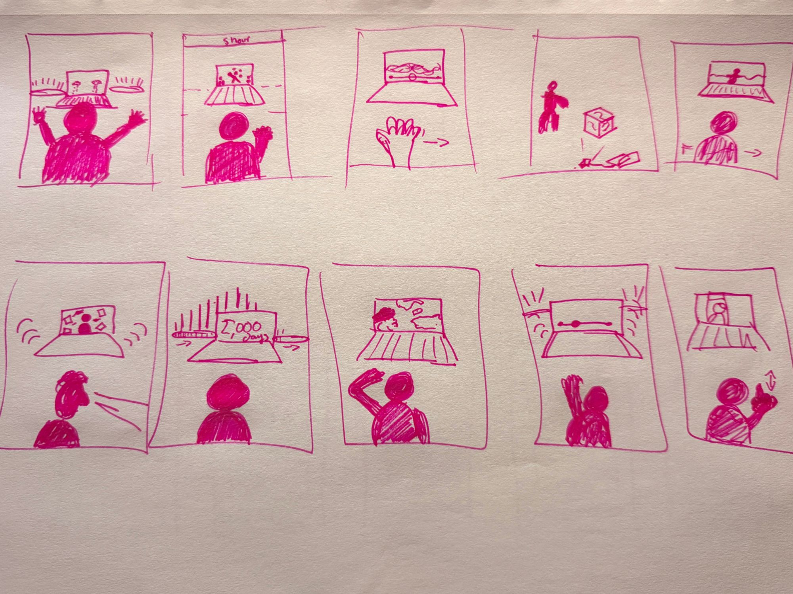

# Concepts

## 1\. Amazon Breath

* Input: live fire detections in the Amazon (NASA FIRMS) \+ my hands through webcam  
* Output: Govee light bars in the room are basically “breathing”. Slowly in and out. But the more fires that are actively burning in the Amazon right now, the faster that breathing gets and the red the entire room becomes.

  If you put your palms down and make almost a sprinkling motion with your hands, it starts to rain (Laptop display). The room cools down, the red fades maybe into blue or white, and the breathing slows back down. But when you stop, it all starts coming back. 

  Then an end displays screen on the laptop with a CTA about climate change

* Why it makes sense: I think the interesting part is that you immediately feel like you fixed something. There’s this instant relief. But you didn’t actually fix it. You can hold the problem back for a second, and then it just comes right back.  
  That’s kind of the whole point.

## 2\. Weight

* Inputs: your daily screen time \+ your posture through a webcam  
* Outputs: you see basically a silhouette of yourself on screen. The screen asks through the new open AI voice LLM “How much time do you spend on your phone? Hold up the number with your fingers”

  Physiologically this already does something by having the user admit to an amount AND if it's over 10, it’s another psychological moment to reflect.  

  Then every hour becomes a stone that falls onto your shoulders gradually over 20 seconds. So if you say eight hours, eight stones. And then the webcam is also watching your posture, and morphs you to start slumping under the weight, the person on screen literally slumps even if you’re standing upright.

  You can shake. You can jump around. You can wave your arms. The rocks might move or glow or shake, but they don’t actually come off.

  Then after around 30 seconds, even more start falling. Maybe around the user as well?   
  At the end:

  *In a study of 402 U.S. college students and recent graduates, participants reported more than 10 hours of screen time per day on average.*

  *Stop carrying the weight of the world on your shoulders.* 

* Why it makes sense:   
  rather than just telling somebody “you spend eight hours a day on your phone,” you literally make them feel what those hours look like as weight.

  And I think the 10+ hour statistic makes that hit way harder because that’s not some random huge number I made up. That was the average reported by actual college students (I can find better studies im sure) 

  It becomes less of a statistic and more like, holy shit, I’m carrying all of that every single day.

## 3\. Phog

* Input: a year of real fog data from Lawrence \+ one hand moving a slider  
* Output: basically you see yourself through the webcam, except you’re standing inside fog and there’s a timeline Ui slider that represents the last 365 days in Lawrence. You move your hand left and right to scrub through it, and the fog around you gets thicker or clearer depending on how foggy Lawrence actually was on that exact day in time. 

* pretty simple, which I actually like. And you’re taking something that would normally just be a weather chart and instead you’re physically standing inside of it.

  You’re not looking at the data, you’re literally inside the data.

## 4\. Smoke Cube

* Input: live wildfire smoke / air-quality data \+ your hands \+ projection onto a physical cube  
* output: there’s basically one physical cube sitting in the room, and it has smoke projected all around the cube itself (like moving shadowy blurry figures) .

  The amount of smoke isn’t random tho, it would match real smoke or air-quality conditions happening (somewhere) right now.

  If you start waving your hands at it, you can literally push the smoke away for a second.  
  And then maybe if you raise both hands, rain starts falling around the cube and the smoke clears almost completely. But again, it comes back.

*  I think people are naturally going to see a cube covered in smoke and want to interact with it somehow. You almost don’t need instructions.

  I really like this idea of giving somebody control, letting them “solve” it, and then taking that control away again because mother nature is truly in control and one person alone cannot “solve” it. 

## 5\. Flood Line

* Input: live Kansas River levels in Lawrence \+ / OR data from the 1951 Lawrence flood \+ your whole body  
* Output: water starts rising up the wall (projected or on display) Like literally, the water line starts at the floor and slowly climbs higher and higher across both the wall and the screen. As long as you keep moving, you can basically hold it back. Stop moving and it starts rising again.

  The entire time it’s working toward the actual height of the 1951 Lawrence flood.  
  Eventually you get the real flood height, how much of Lawrence was affected, and what actually happened.

* I feel like if you walk into a room and water is literally rising up the wall, your instinct is going to be to do something.

  And the more it rises, the more frantic you probably get. But you wont be able to stop it forever.

## 6\. Noise

* Input: the live rate of posts being published on Bluesky \+ your eyes, hands, and fists  
* Ouput: You see yourself on the screen, almost like a mirror.

  But your reflection really only exists when you’re looking away from it.  
  While you look away, live internet activity starts pouring into the screen as visual noise and sound of clicks and engagement \*boosts\* effects. More posts happening online \= more noise surrounding you.

  Then the second you look directly back at the screen, close your eyes, or close both fists, everything goes quiet.

  So it’s basically a mirror that doesn’t want your attention. The more attention you give the screen, the less of yourself you can actually see.

  Which feels kind of backwards at first, and then I think the point starts to hit.

## 7\. Days Wasted

* Input: your daily screen time \+ time (Open Ai voice model asks in a BOOMING voice for your screentime. Hold up number of fingers, or say them? Or type them)  
* Output: the light bars basically become the sun.

  You watch one full day move through the room. Sunrise, afternoon, sunset. Then another day starts. And another. So on and son on. 

  The more screen time you said you have, the faster the days start moving.  
  Eventually it gets kind of insane. Weeks are passing. Then months. The sunrise and sunset are basically just flashing back and forth across the room (animating across the light bar) And then it suddenly stops.

  The final number shows how many entire days of your LIFE you WOULD spend looking at a screen if you continue your daily screen time habit. 

  Why it makes sense: saying “you spend 2,000 hours a year on your phone” doesn’t really mean anything to me.

  But if you literally watch 80 days disappear in front of you… hits different. 

## 8\. Wipe

* Input: live PM2.5 / air-pollution data from different cities \+ your hands  
* Output: there are a few cities you can swipe through using your hand, almost like cards on a phone.

  You pick one, and then your webcam image slowly starts getting dirtier depending on how polluted the air in that city actually is right now.

  Basically like someone is covering a window in grime.  
  So naturally, you wipe it. And it clears. Then you stop wiping.

  And it immediately starts getting dirty again.  
  At the end, I want to somehow translate that into how much work your lungs are basically doing for you all day just to deal with the air you’re breathing.

  everyone understands wiping off a dirty window. Except the window is basically your lungs, and unlike the actual screen, you can’t just wipe your lungs clean.

## 9\. Phantom Buzz

* Input: a screenshot of your own iPhone Screen Time page \+ a timeline controlled by your hand  
* What would happen: you hold your Screen Time page up to the camera, and the installation reads your actual notifications-per-day number.

  So now we’re not using some average. It’s literally yours.  
  Then a timeline appears from midnight to midnight.

  As you move your hand through the day, the light bars buzz every time you would normally get a notification AND sound of each one. 

  Move your hand really fast across the day and suddenly it basically becomes a swarm.  
  I think this one could get really overwhelming really fast, which is kind of the point.  
  You might not notice 150 notifications when they’re spread across an entire day.  
  Compress them into 10 seconds and suddenly you’re like, okay. That is actually insane.

## 10\. Scroll

* Input: the TikTok-style swipe-up gesture \+ the live rate of posts being published online  
* Output: your own face is basically the feed.  
  You swipe up like you’re scrolling TikTok, except every “new post” is another version of you.  
  Each version has changed a little bit more. Maybe your face is more distorted. Maybe more artificial. Maybe pieces of it are literally being pulled away or replaced by the feed.

  And the faster the internet is posting right now, the faster every swipe changes you.  
  But if you stop scrolling, you slowly start becoming yourself again.  
  everyone already knows what the gesture means.  
  Swipe. New thing.  
  Swipe. New thing, etc.

  Except eventually you realize you aren’t actually consuming the feed anymore.  
  The feed is consuming you.

## References

**1\. The Treachery of Sanctuary (Chris Milk, 2012\)**  
Three 30-foot panels where users stands in front and their shadow is projected back, and birds tear it apart, then it grows wings when you raise your arms. 

Input: your body's silhouette (cam)  
Output: projected video of your shadow, altered; reactive sound  
Link: [milk.co/treachery](http://milk.co/treachery)

**2\. Data-driven Wind Map (Fernanda Viégas & Martin Wattenberg, 2012\)**  
A living image of wind over the US, redrawn every hour from the National Weather Service forecast. No interaction because the data is the motion. In MoMA's collection\!

Input: live NWS wind forecast  
Output: an animated, flowing image on screen  
Link: [hint.fm/projects/wind](http://hint.fm/projects/wind/)

**3\. Both Pulse Room (Rafael Lozano-Hemmer, 2006\)**  
300 hanging bulbs where you have to grip a sensor and your heartbeat takes over the nearest bulb, and pushes every previous visitor's heartbeat one bulb down the line. Your body becomes the data input, and the data of 300 strangers is the room.

Input: your pulse (a sensor you touch)  
Output: 300 flashing lights, plus a sound of the heartbeat  
Links:   
[MoMA](https://www.moma.org/collection/works/180180)  
 [artist's site](https://www.lozano-hemmer.com/projects.php)

## Sketches

